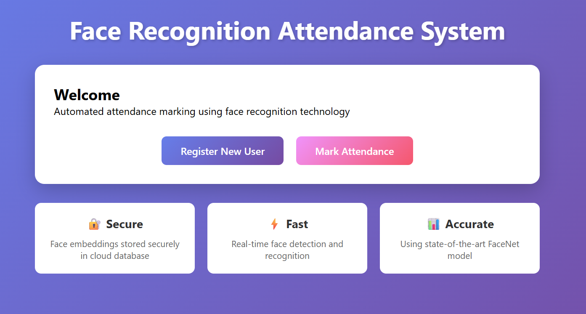

## Face Recognition Attendance System



### What it does
- **Register users**: Upload a face image to generate a FaceNet embedding and store it in Supabase.
- **Mark attendance from video**: Processes uploaded video frames and matches faces via vector similarity.
- **Clean web UI**: Simple pages for home, registration, and attendance.

### Tech stack
- **Backend**: FastAPI, Jinja2 Templates
- **ML**: facenet-pytorch (MTCNN + InceptionResnetV1), PyTorch, OpenCV, NumPy
- **Database**: Supabase (Postgres + RPC for vector similarity)
- **Frontend**: HTML/CSS/JS in `templates` and `static`

### Quick start
1. Create and activate a virtual environment.
   - Windows (PowerShell):
     ```bash
     python -m venv venv
     .\\venv\\Scripts\\Activate.ps1
     ```
2. Install dependencies:
   ```bash
   pip install -r requirements.txt
   ```
3. Configure environment variables:
   - Copy `.env.example` to `.env` and set `SUPABASE_URL` and `SUPABASE_KEY`.
4. Initialize database (in Supabase SQL editor or psql) using `setup_database.sql`.
5. Run the server:
   ```bash
   uvicorn app.main:app --reload
   ```
6. Open `http://localhost:8000`.

### Key API endpoints
- `GET /` — Home
- `GET /register` — Registration page
- `GET /attendance` — Attendance page
- `POST /api/register` — Form-data: `roll_number`, `full_name`, `image` (file). Returns status and saved user info.
- `POST /api/process-video` — Form-data: `video` (mp4). Returns `session_id` and attendance list.
- `GET /api/attendance/{session_id}` — Fetch attendance for a session.

### Configuration
- Tune thresholds and frame skipping in `app/config.py`:
  - `FACE_RECOGNITION_THRESHOLD` (default 0.6)
  - `SKIP_FRAMES` (default 5)

### Project structure
```
app/                # FastAPI app, config, models, database, recognition
static/             # CSS/JS assets
templates/          # Jinja2 HTML templates
setup_database.sql  # Tables + RPC for similarity search
requirements.txt
```
